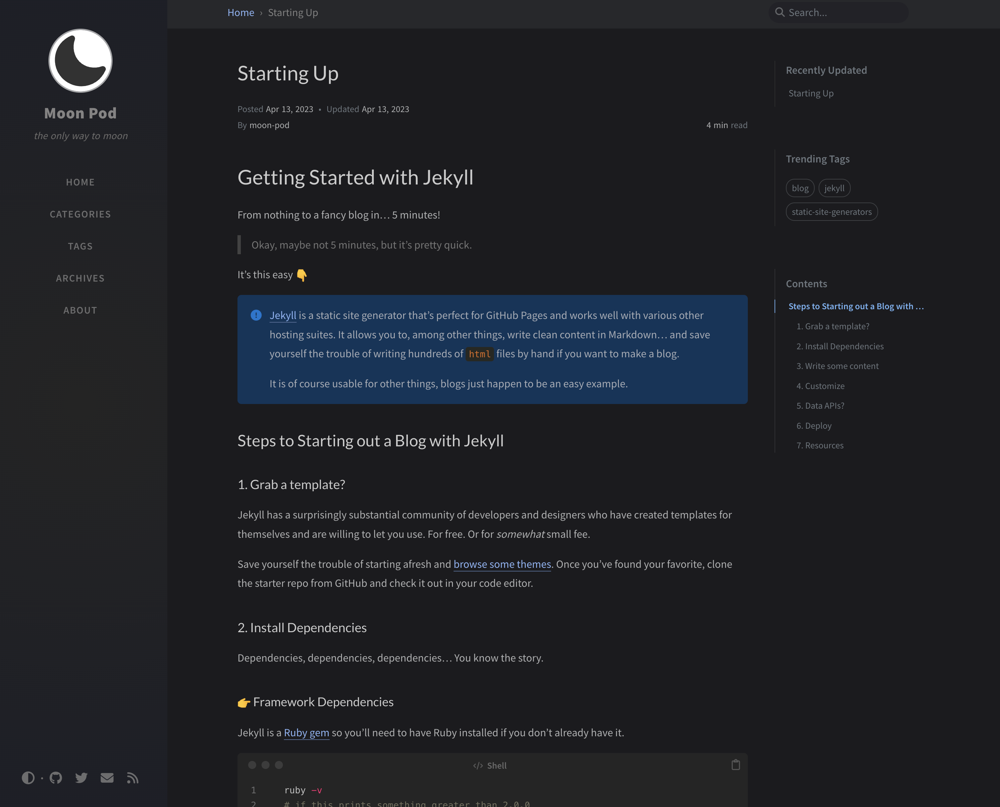

# CS52 ELI5: moon pod

## Presentation

[link to presentation](http://docs.google.com)

## Review

Implemented tutorial :point_right: [link][tutorial-video].

Live site :point_right: [link][live-site].

### Overview of what was involved

After digging through some Jekyll tutorials and documentation, we
found tons of starter templates. We decided to start from one of them.
For a start, we imported the theme's structure into our project.
We then went on to customize the site info and write our own content
(a blog post on getting started with Jekyll).

Afterward, we populated up the `about` tab with our own `HTML` components
and data. This was how we tested the way Jekyll interacts with user
data and custom components.

Starter theme :point_right: [site][starter-theme], [github][starter-theme-github].

#### Site Screenshot

### How did it go?

Pretty good! We found a very helpful tutorial, and Jekyll is overall
not tough to work with.

###  Rating

<!-- three stars out of five -->
:star: :star: :star:

## Resources

- More on static vs. dynamic sites :point_right: [video][static-vs-dynamic].
- More on static site generators :point_right: [video][static-site-gen].
- Tutorial on Jekyll :point_right: [video][tutorial-video].
- Tutorial on Jekyll :point_right: [article][tutorial-article-1].
- Tutorial on Jekyll :point_right: [article][tutorial-article-2].
- Tutorial on Jekyll :point_right: [article][tutorial-article-3].
- Jekyll official docs :point_right: [link][jekyll-docs].

[jekyll]:   https://www.npmjs.com/package/jekyll
[themes]:   https://jekyllthemes.io/
[ruby-gem]: https://guides.rubygems.org/rubygems-basics/
[jemoji]:   https://github.com/jekyll/jemoji

[starter-theme]:          https://chirpy.cotes.page/posts/getting-started/
[starter-theme-github]:   https://github.com/cotes2020/chirpy-starter

[live-site]:              https://moon-pod.onrender.com

[static-vs-dynamic]:      https://www.youtube.com/watch?v=_wFJj94kSTU
[static-site-gen]:        https://www.youtube.com/watch?v=3INXQ_4W42g
[tutorial-video]:         https://youtu.be/F8iOU1ci19Q
[tutorial-article-1]:     https://www.taniarascia.com/make-a-static-website-with-jekyll/
[tutorial-article-2]:     https://www.section.io/engineering-education/build-a-jekyll-site/
[tutorial-article-3]:     https://www.smashingmagazine.com/2014/08/build-blog-jekyll-github-pages/
[jekyll-docs]:            https://jekyllrb.com/docs/
